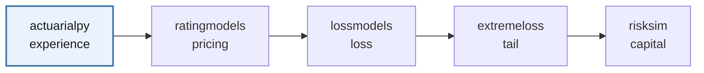

# OpenActuarial

**Open-source actuarial tooling for Python** — a small, composable ecosystem for
experience analysis, pricing, loss modeling, and capital, organized around a
shared core.

📚 **Documentation: [openactuarial.org](https://openactuarial.org)** · License: MIT

---

## The ecosystem

| Package | What it does | Install |
| --- | --- | --- |
| **[actuarialpy](https://openactuarial.org/actuarialpy/)** | Experience analysis **and the shared core** — PMPM and loss-ratio metrics, trend, completion, seasonality, credibility, financial mathematics (time value of money), and exposure. `ratingmodels` builds directly on it. | `pip install actuarialpy` |
| **[ratingmodels](https://openactuarial.org/ratingmodels/)** | Group rate build-up and indication — manual and experience rating, an auditable build-up engine, GLM relativities, retention gross-up, and renewal. | `pip install ratingmodels` |
| **[lossmodels](https://openactuarial.org/lossmodels/)** | Loss-distribution modeling — severity and frequency fitting, and aggregate loss. | `pip install lossmodels` |
| **[extremeloss](https://openactuarial.org/extremeloss/)** | Extreme-value tail estimation — peaks-over-threshold / GPD and large-claim loading. | `pip install extremeloss` |
| **[risksim](https://openactuarial.org/risksim/)** | Portfolio Monte Carlo simulation and risk measures. | `pip install risksim` |

## How they compose

Left to right, the packages trace one analysis — experience, pricing, loss, tail,
and capital:



The arrows are the analytical sequence, not install requirements. `actuarialpy`
is the shared core — credibility, trend, financial math, and exposure live there
once — and `ratingmodels` builds directly on it. `lossmodels`, `extremeloss`, and
`risksim` install independently (`extremeloss` can optionally integrate
`lossmodels` for severity splicing). Dependencies stay light throughout: numpy
and pandas, with scipy where the loss and tail work needs it.

## A workflow across the ecosystem

Credibility comes from the core; the rate build-up and indication come from `ratingmodels` — the two compose directly:

```python
import actuarialpy as ap
import ratingmodels as rm

# core: credibility for the group's own experience
z = ap.limited_fluctuation_z(exposure=96_000, full_credibility_standard=120_000)

# pricing: build the manual rate, blend against experience, and indicate
manual = rm.ManualRate(base_pmpm=480, factors={"area": 1.05, "industry": 0.97})

indication = rm.RateIndication(
    experience_claims_pmpm=512,
    manual_claims_pmpm=manual.claims_pmpm(),
    credibility=z,
    current_rate=560,
    target_loss_ratio=0.85,
)

indication.indicated_rate_change()       # the indicated rate change
indication.rate_change_decomposition()   # an auditable explanation of why it moved
```

## Getting started

Install any package with `pip` (above). Each has its own guide and full API
reference at **[openactuarial.org](https://openactuarial.org)**.

## License

All packages are released under the MIT License.
